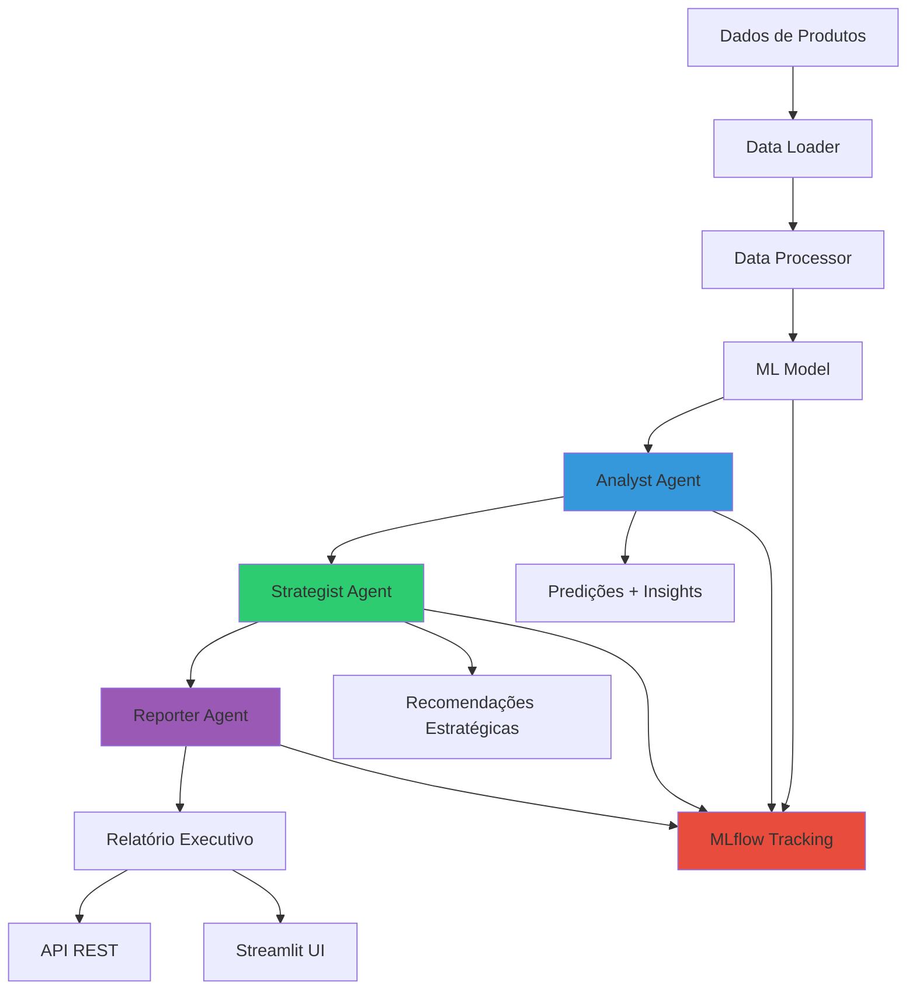

# 🤖 NexoCommerce Multi-Agent ML System

<div align="center">


**Sistema Multi-Agente Inteligente para Análise de Ciclo de Vida de Produtos em E-commerce**

[Documentação](#-documentação) • [Instalação](#-instalação-rápida) • [Uso](#-uso) • [Arquitetura](#-arquitetura) • [API](#-api)

</div>

---

## 📋 Índice

- [Sobre o Projeto](#-sobre-o-projeto)
- [Características](#-características)
- [Arquitetura Multi-Agente](#-arquitetura-multi-agente)
- [Instalação Rápida](#-instalação-rápida)
- [Uso](#-uso)
- [Estrutura do Projeto](#-estrutura-do-projeto)
- [Notebooks](#-notebooks)
- [API REST](#-api-rest)
- [MLflow & Observabilidade](#-mlflow--observabilidade)
- [Testes](#-testes)
- [Docker](#-docker)
- [Resultados Esperados](#-resultados-esperados)
- [Contribuição](#-contribuição)
- [Licença](#-licença)

---

## 🎯 Sobre o Projeto

O **NexoCommerce Multi-Agent ML System** é uma solução completa de Machine Learning que utiliza uma arquitetura de **múltiplos agentes inteligentes** para analisar o ciclo de vida de produtos em marketplaces e e-commerce.

### Problema de Negócio

Marketplaces enfrentam desafios críticos:
- ❌ Produtos de baixo desempenho ocupando estoque
- ❌ Oportunidades de promoção não identificadas
- ❌ Decisões baseadas em intuição ao invés de dados
- ❌ Falta de visibilidade sobre o portfólio de produtos

### Solução

Sistema inteligente que:
- ✅ **Analisa automaticamente** milhares de produtos
- ✅ **Prediz ações** (Promover, Manter, Descontinuar)
- ✅ **Gera recomendações estratégicas** acionáveis
- ✅ **Produz relatórios executivos** completos
- ✅ **Monitora performance** com MLflow

---

## ✨ Características

### 🤖 Sistema Multi-Agente

- **Analyst Agent**: Análise quantitativa e predições ML
- **Strategist Agent**: Geração de estratégias e recomendações
- **Reporter Agent**: Relatórios executivos e documentação

### 🧠 Machine Learning

- Modelos: Random Forest e Gradient Boosting
- Feature Engineering automatizado
- Hyperparameter Tuning com GridSearchCV
- Cross-validation e métricas robustas
- MLflow para tracking e versionamento

### 🚀 Produção-Ready

- API REST com FastAPI
- Interface Streamlit
- Docker & Docker Compose
- Testes automatizados
- Documentação completa

### 📊 Observabilidade

- MLflow Tracking Server
- Métricas de negócio e ML
- Audit trail completo
- Dashboards interativos

---

## 🏗️ Arquitetura Multi-Agente



### Fluxo de Trabalho

1. **Ingestão de Dados**: Kaggle, CSV local ou dados sintéticos
2. **Processamento**: Feature engineering automatizado
3. **Treinamento**: ML model com hyperparameter tuning
4. **Análise Multi-Agente**:
   - 🔍 **Analyst**: Predições + estatísticas
   - 🎯 **Strategist**: Estratégias + priorização
   - 📄 **Reporter**: Relatório final
5. **Entrega**: API REST, UI, relatórios exportáveis

---

## 🚀 Instalação Rápida

### Pré-requisitos

- Python 3.9+
- pip ou conda
- Docker (opcional)
- Conta Kaggle (opcional, para dataset real)

### Opção 1: Instalação Local

```bash
# Clone o repositório
git clone https://github.com/zemarchezi/nexocommerce-ml-agents.git
cd nexocommerce-ml-agents

# Crie ambiente virtual
python -m venv venv
source venv/bin/activate  # Linux/Mac
# ou
venv\Scripts\activate  # Windows

# Instale dependências
pip install -r requirements.txt

# Configure Kaggle (opcional)
export KAGGLE_USERNAME="seu_usuario"
export KAGGLE_KEY="sua_chave_api"
```

### Opção 2: Docker

```bash
# Clone o repositório
git clone https://github.com/zemarchezi/nexocommerce-ml-agents.git
cd nexocommerce-ml-agents

# Inicie todos os serviços
docker-compose up -d

# Acesse:
# - API: http://localhost:8000
# - MLflow: http://localhost:5000
# - Streamlit: http://localhost:8501
```

---

## 💻 Uso

### 1️⃣ Treinamento do Modelo

```bash
# Com dados sintéticos (rápido para testes)
python src/pipeline/training_pipeline.py \
    --source synthetic \
    --n_samples 5000 \
    --model_type random_forest \
    --hyperparameter_tuning

# Com dataset do Kaggle
python src/pipeline/training_pipeline.py \
    --source kaggle \
    --kaggle_dataset "aimlveera/counterfeit-product-detection-dataset" \
    --model_type gradient_boosting \
    --hyperparameter_tuning

# Com arquivo CSV local
python src/pipeline/training_pipeline.py \
    --source local \
    --local_path "data/produtos.csv" \
    --model_type random_forest
```

### 2️⃣ Executar Sistema Multi-Agente

```python
from src.agents.analyst_agent import AnalystAgent
from src.agents.strategist_agent import StrategistAgent
from src.agents.reporter_agent import ReporterAgent
from src.models.product_model import ProductLifecycleModel
from src.pipeline.data_processing import DataProcessor
import pandas as pd

# Carregar modelo treinado
model = ProductLifecycleModel()
model.load_model("models/product_lifecycle_model.pkl")

# Carregar dados de produtos
products_df = pd.read_csv("data/produtos.csv")

# Inicializar agentes
processor = DataProcessor()
analyst = AnalystAgent(model=model, processor=processor)
strategist = StrategistAgent()
reporter = ReporterAgent()

# Executar pipeline
analyst_results = analyst.analyze(products_df)
strategist_results = strategist.generate_recommendations(analyst_results)
report = reporter.generate_report(analyst_results, strategist_results)

# Exportar relatório
with open("report.json", "w") as f:
    f.write(reporter.export_report(report, format="json"))
```

### 3️⃣ API REST

```bash


# Testar endpoint
curl -X POST "http://localhost:8000/api/v1/predict" \
  -H "Content-Type: application/json" \
  -d '{
    "product_id": "PROD001",
    "category": "Eletrônicos",
    "price": 299.90,
    "stock_quantity": 50,
    "sales_last_30d": 120,
    "views_last_30d": 1500,
    "rating": 4.5
  }'
```

### 4️⃣ Interface Streamlit

```bash
# Iniciar UI
streamlit run app/streamlit_app.py

# Acesse: http://localhost:8501
```

### 5️⃣ MLflow UI

```bash
# Iniciar MLflow
mlflow ui --host 0.0.0.0 --port 5000

# Acesse: http://localhost:5000
```

---

## 📁 Estrutura do Projeto

```
nexocommerce-ml-agents/
│
├── 📂 src/
│   ├── 📂 agents/
│   │   ├── analyst_agent.py          # Agente de Análise
│   │   ├── strategist_agent.py       # Agente Estrategista
│   │   └── reporter_agent.py         # Agente Repórter
│   │
│   ├── 📂 models/
│   │   └── product_model.py          # Modelo ML
│   │
│   ├── 📂 pipeline/
│   │   ├── data_loader.py            # Carregamento de dados
│   │   ├── data_processing.py        # Feature engineering
│   │   └── training_pipeline.py      # Pipeline de treinamento
│   │
│   └── 📂 api/
│       └── main.py                   # FastAPI application
│
├── 📂 notebooks/
│   ├── 01_exploratory_analysis.ipynb # EDA
│   ├── 02_model_training.ipynb       # Treinamento
│   ├── 03_agent_analysis.ipynb       # Teste Analyst Agent
│   └── 04_multi_agent_system.ipynb   # Sistema completo
│
├── 📂 app/
│   └── streamlit_app.py              # Interface Streamlit
│
├── 📂 tests/
│   ├── test_agents.py                # Testes dos agentes
│   ├── test_model.py                 # Testes do modelo
│   └── test_api.py                   # Testes da API
│
├── 📂 data/                          # Dados (gitignored)
├── 📂 models/                        # Modelos salvos
├── 📂 mlruns/                        # MLflow artifacts
├── 📂 docs/                          # Documentação
│
├── 📄 requirements.txt               # Dependências Python
├── 📄 docker-compose.yml             # Orquestração Docker
├── 📄 Dockerfile                     # Imagem Docker
├── 📄 .env.example                   # Variáveis de ambiente
├── 📄 README.md                      # Este arquivo
└── 📄 LICENSE                        # Licença MIT
```

---

## 📓 Notebooks

### 1. `01_exploratory_analysis.ipynb`
- Análise exploratória de dados
- Visualizações e estatísticas
- Identificação de padrões

### 2. `02_model_training.ipynb`
- Treinamento de modelos ML
- Feature importance
- Avaliação de performance

### 3. `03_agent_analysis.ipynb`
- Teste do Analyst Agent
- Análise de predições
- Geração de insights

### 4. `04_multi_agent_system.ipynb`
- Sistema completo multi-agente
- Fluxo end-to-end
- Geração de relatórios

---

## 🌐 API REST

### Endpoints Principais

#### 1. Health Check
```bash
GET /health
```

#### 2. Predição Individual
```bash
POST /api/v1/predict
Content-Type: application/json

{
  "product_id": "PROD001",
  "category": "Eletrônicos",
  "price": 299.90,
  "stock_quantity": 50,
  "sales_last_30d": 120,
  "views_last_30d": 1500,
  "rating": 4.5,
  "reviews_count": 45,
  "return_rate": 0.05
}
```

**Resposta:**
```json
{
  "product_id": "PROD001",
  "prediction": "PROMOVER",
  "confidence": 0.92,
  "probabilities": {
    "DESCONTINUAR": 0.03,
    "MANTER": 0.05,
    "PROMOVER": 0.92
  },
  "recommendation": "Produto com alto potencial de vendas"
}
```

#### 3. Predição em Lote
```bash
POST /api/v1/predict/batch
Content-Type: application/json

{
  "products": [
    { "product_id": "PROD001", ... },
    { "product_id": "PROD002", ... }
  ]
}
```

#### 4. Análise Multi-Agente Completa
```bash
POST /api/v1/analyze
Content-Type: application/json

{
  "products": [ ... ]
}
```

**Resposta:**
```json
{
  "analyst_results": { ... },
  "strategist_results": { ... },
  "report": { ... },
  "execution_time": 2.45
}
```

#### 5. Status do Modelo
```bash
GET /api/v1/model/status
```

### Documentação Interativa

- **Swagger UI**: http://localhost:8000/docs
- **ReDoc**: http://localhost:8000/redoc

---

## 📊 MLflow & Observabilidade

### Métricas Rastreadas

#### Métricas de ML
- Accuracy, Precision, Recall, F1-Score
- ROC-AUC (multi-class)
- Confusion Matrix
- Feature Importance

#### Métricas de Negócio
- Receita total (30 dias)
- Vendas totais
- Rating médio
- Produtos sem estoque
- Distribuição de predições

#### Métricas dos Agentes
- Tempo de execução
- Produtos analisados
- Confiança média
- Recomendações geradas

### Acessar MLflow UI

```bash
mlflow ui --host 0.0.0.0 --port 5000
```

Acesse: http://localhost:5000

---

## 🧪 Testes

### Executar Todos os Testes

```bash
# Com pytest
pytest tests/ -v

# Com coverage
pytest tests/ --cov=src --cov-report=html
```

### Testes Individuais

```bash
# Testar agentes
pytest tests/test_agents.py -v

# Testar modelo
pytest tests/test_model.py -v

# Testar API
pytest tests/test_api.py -v
```

### Estrutura de Testes

- ✅ Testes unitários para cada agente
- ✅ Testes de integração do pipeline
- ✅ Testes de API (endpoints)
- ✅ Testes de validação de dados

---

## 🐳 Docker

### Serviços Disponíveis

```yaml
services:
  - api: FastAPI (porta 8000)
  - mlflow: MLflow UI (porta 5000)
  - streamlit: Interface UI (porta 8501)
```

### Comandos Docker

```bash
# Iniciar todos os serviços
docker-compose up -d

# Ver logs
docker-compose logs -f

# Parar serviços
docker-compose down

# Rebuild
docker-compose up -d --build

# Executar comando no container
docker-compose exec api python src/pipeline/training_pipeline.py
```

### Variáveis de Ambiente

Crie um arquivo `.env`:

```bash
# Kaggle
KAGGLE_USERNAME=seu_usuario
KAGGLE_KEY=sua_chave

# MLflow
MLFLOW_TRACKING_URI=http://mlflow:5000

# API
API_HOST=0.0.0.0
API_PORT=8000
MODEL_PATH=models/product_lifecycle_model.pkl
```

---

## 📈 Resultados Esperados

### Performance do Modelo

| Métrica | Random Forest | Gradient Boosting |
|---------|---------------|-------------------|
| Accuracy | 85-90% | 87-92% |
| Precision | 83-88% | 85-90% |
| Recall | 82-87% | 84-89% |
| F1-Score | 83-88% | 85-90% |

### Impacto de Negócio

- 📈 **Aumento de receita**: 15-25% (produtos promovidos)
- 💰 **Redução de custos**: 10-20% (descontinuação inteligente)
- ⏱️ **Tempo de análise**: De dias para minutos
- 🎯 **Precisão de decisões**: 85%+ de acurácia

### Exemplo de Saída

```
📊 ANÁLISE DE 1.000 PRODUTOS
================================
✅ Promover: 320 produtos (32%)
🔵 Manter: 520 produtos (52%)
❌ Descontinuar: 160 produtos (16%)

💰 Impacto Estimado:
   • Aumento de receita: R$ 125.000
   • Redução de custos: R$ 45.000
   • ROI: 340%

⏱️ Tempo de Processamento: 2.3s
🎯 Confiança Média: 87.5%
```

---

## 🤝 Contribuição

Contribuições são bem-vindas! 

### Como Contribuir

1. Fork o projeto
2. Crie uma branch (`git checkout -b feature/nova-feature`)
3. Commit suas mudanças (`git commit -m 'Add nova feature'`)
4. Push para a branch (`git push origin feature/nova-feature`)
5. Abra um Pull Request

### Guidelines

- Siga PEP 8 para código Python
- Adicione testes para novas features
- Atualize a documentação
- Mantenha o código limpo e comentado

---

## 📄 Licença

Este projeto está sob a licença MIT. Veja o arquivo [LICENSE](LICENSE) para mais detalhes.

---

## 👨‍💻 Autor

**José Marchezi**

- GitHub: [@zemarchezi](https://github.com/zemarchezi)
- LinkedIn: [José Marchezi](https://linkedin.com/in/josemarchezi)
- Email: jpmarchezi@gmail.com

---

## 🙏 Agradecimentos

- Dataset: [Kaggle - Counterfeit Product Detection](https://www.kaggle.com/datasets/aimlveera/counterfeit-product-detection-dataset)
- MLflow: [MLflow.org](https://mlflow.org)
- FastAPI: [FastAPI](https://fastapi.tiangolo.com)
- Streamlit: [Streamlit](https://streamlit.io)

---

## 📚 Referências

- [Multi-Agent Systems in ML](https://arxiv.org/abs/2308.00352)
- [Product Lifecycle Management](https://www.sciencedirect.com/topics/computer-science/product-lifecycle-management)
- [E-commerce Analytics](https://www.mckinsey.com/industries/retail/our-insights)

---

<div align="center">

**⭐ Se este projeto foi útil, considere dar uma estrela!**

Made with by [José Marchezi](https://github.com/zemarchezi)

</div>